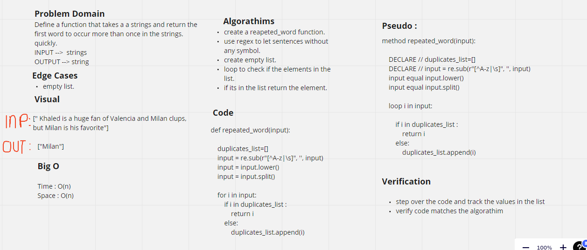

# REpeated Word

* Define an Repeated word function, to find the first repeated word.

## Challenge :

* Check the whole sentence and the output should be the first repeated word.

* Utilize the Single-responsibility principle: any methods you write should be clean, reusable, abstract component parts to the whole challenge.

## Approach & Efficiency:

* Time -> O(n).
* Space -> O(n).

## Solution :

