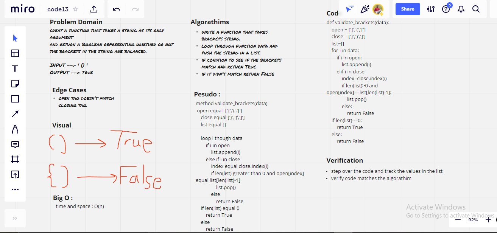

# stack-queue-brackets

* A function that takes a string as its only argument
and return a Boolean representing whether or not the brackets in the string are balanced.

## Whiteboard Process

## Approach & Efficiency

Big O :

time and space -> O(n)