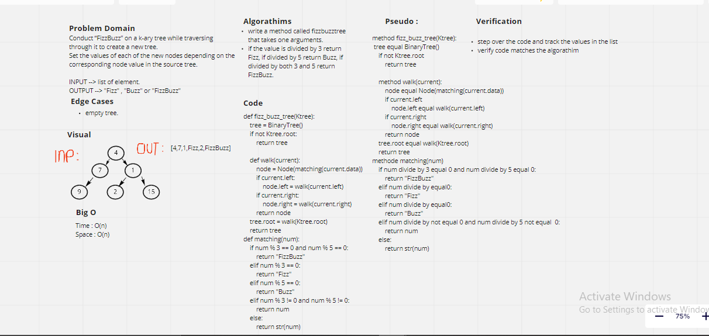

# Tree Fizz Buzz 

* Create function called fizz_buzz which takes a tree_data as an argument.

## Challenge 

* Create a new tree with the same previous code and modify ..
 
  * If the value is divisible by 3, replace the value with “Fizz”
  
  * If the value is divisible by 5, replace the value with “Buzz”
  
  * If the value is divisible by 3 and 5, replace the value with “FizzBuzz”
  
  * If the value is not divisible by 3 or 5, simply turn the number into a String.

## Approach & Efficiency:

Big O :

Time -> O(n)

Space -> O(n)

## Whiteboard

