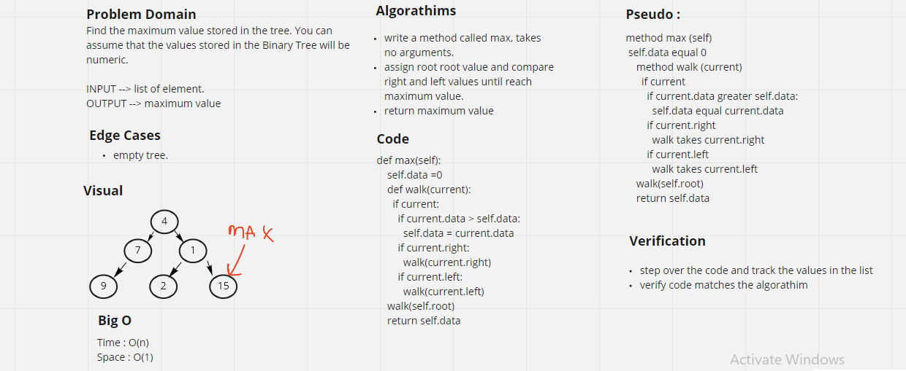
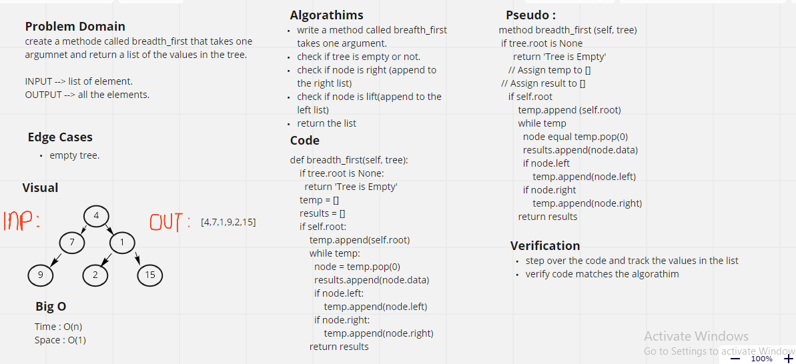

# Trees

* Define a method for each of the depth first traversals called pre_order, in_order, and post_order which returns an array of the values, ordered appropriately.

## Challenge

Create a Node class that has properties for the value stored in the node, left node, and the right node. Also create a BinaryTree class.

## Approach & Efficiency

**Big O :**

Time -> O(n)
Space -> O(1)

**Binary Search Trees**

 A Binary Search Tree is a type of tree that does have some structure attached to it. In a binary search tree, nodes are organized in a manner where all values that are smaller than the root are placed to the left, and all values that are larger than the root are placed to the right.

## API

Pre-order: root » left » right

In-order: left » root » right

Post-order: left » right » root

# Max Value in tree:

* Create a method that find the maximum value stored in the tree. You can assume that the values stored in the Binary Tree will be numeric.

## Challenge:

* Find the maximum number in the tree.

## Approach & Efficiency:

Time complexity => O(n)
Space complexity => O(1)

## Whiteboard

# Breadth First

* write  a function that takes a tree and returns its values as a list sorted according to breadth value.

## Challenge 

* trying to deal with the tree as node and right and left.

## Approach & Efficiency:

Time complexity => O(n)
Space complexity => O(1)

## Whiteboard

