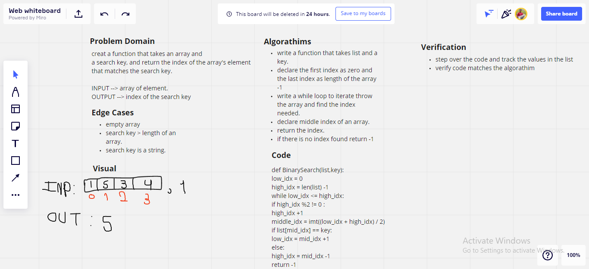

# Binary Search of Sorted Array
Create a function that takes an array and
a search key, and return the index of the array's element that matches the search key.

## Whiteboard Process

## Approach & Efficiency

**Big O**
time - O(logn) 
space - O(logn)