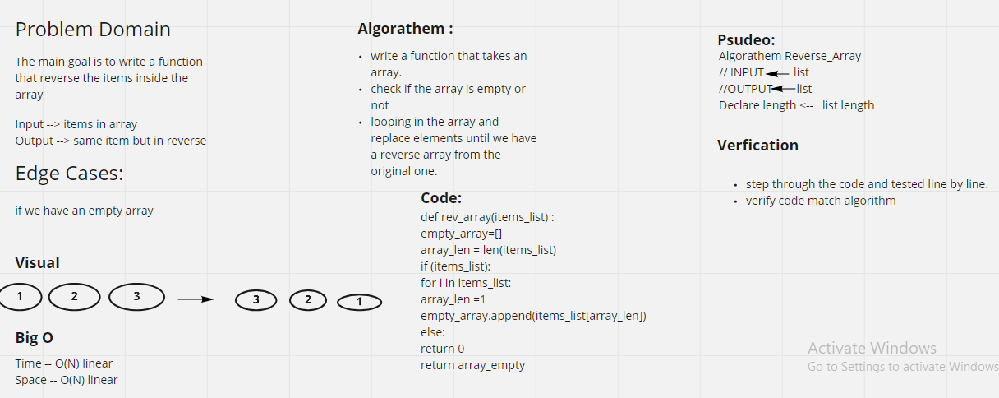

# Reverse an Array
write a function that takes a an array and reverse it elements

## Whiteboard Process

## Approach & Efficiency
I took the looping approach to get the item from the input array and saved it reversely in the output array.
Big O is O(N).