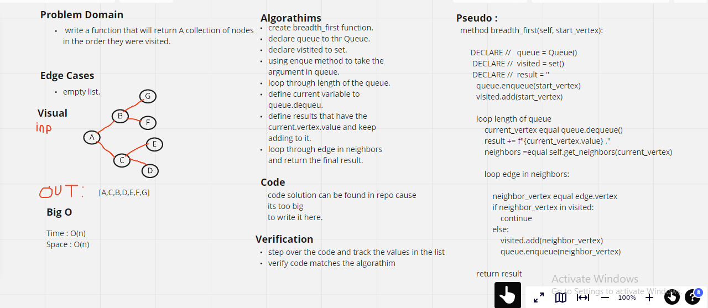

# Graph breadth first

* add node
    - Arguments: value
    - Returns: The added node
    - Add a node to the graph

* add edge
    - Arguments: 2 nodes to be connected by the edge, weight (optional)
    - Returns: nothing

## Challenge:

* Node can be successfully added to the graph.

* An edge can be successfully added to the graph.

* A collection of all nodes can be properly retrieved from the graph.

## Approach & Efficiency:

Big O:

time -> O(1)
space -> O(1)

## Solution:

