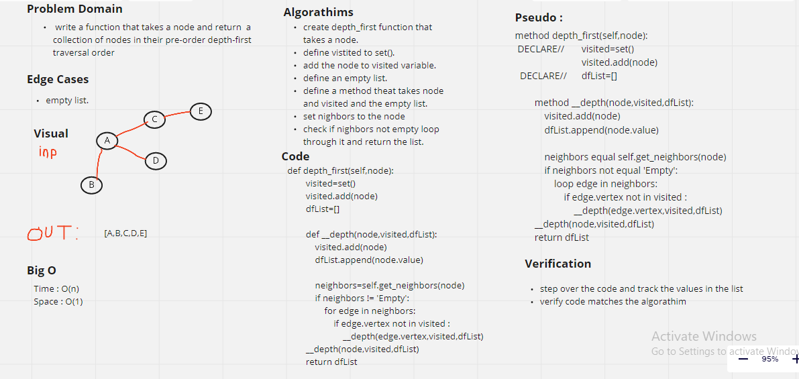

# Graph Depth First

* A function called depth first takes list and node to display the collection.

## Challenge:

* Return collection of nodes in their pre-order depth-first traversal order.

## Approach & Efficiency:

Big O:

time -> O(n)
space -> O(1)

## Solution:

