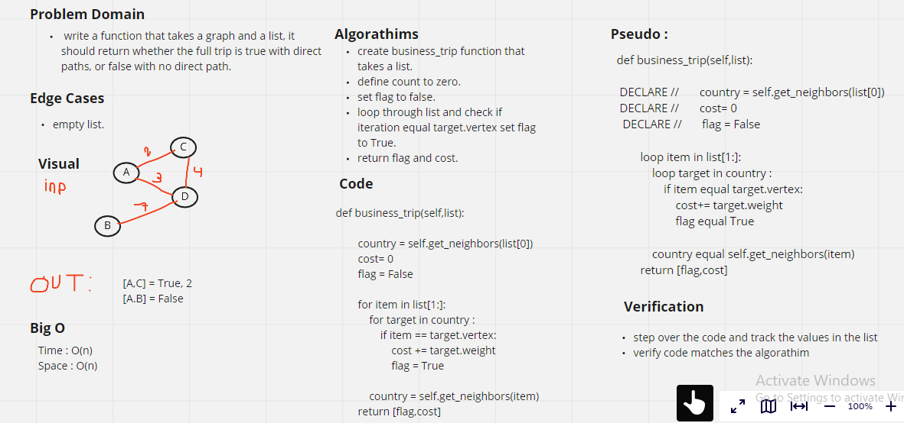

# Graph business trip

* Write a function called business trip
Arguments: graph, array of city names

Return: cost or null.

## Challenge:

* Determine whether the trip is possible with direct flights, and how much it would cost.

## Approach & Efficiency:

Big O:

time -> O(n)
space -> O(n)

## Solution:

