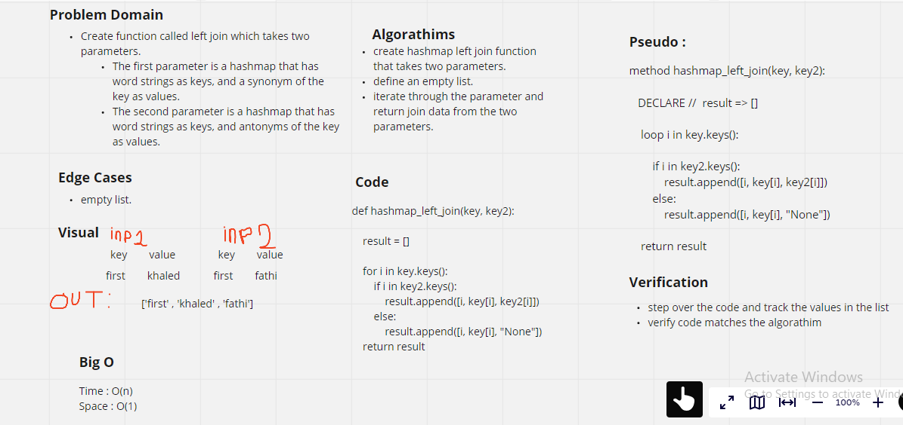

# Hashmap left join

* The left-join keyword returns all records from the left table(t1), so the matched records from the right table (t2). The result is None from the right side, if there is no match.

## Challenge

* Create function called left join which takes two parameters.

    - The first parameter is a hashmap that has word strings as keys, and a synonym of the key as values.

    - The second parameter is a hashmap that has word strings as keys, and antonyms of the key as values.

## Approach & Efficiency:

Big O :
time -> O(n)
space -> O(1)

## Solution :

