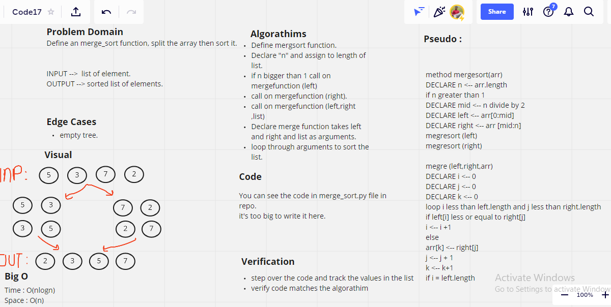

# Merge Sort 

* Define an merge_sort function, split the array then sort it.

## Challenge

* Splitting the array then to sort the array.

## Approach & Efficiency:

* time -> O(nlog(n))
* space -> O(n)

## Whiteboard 

