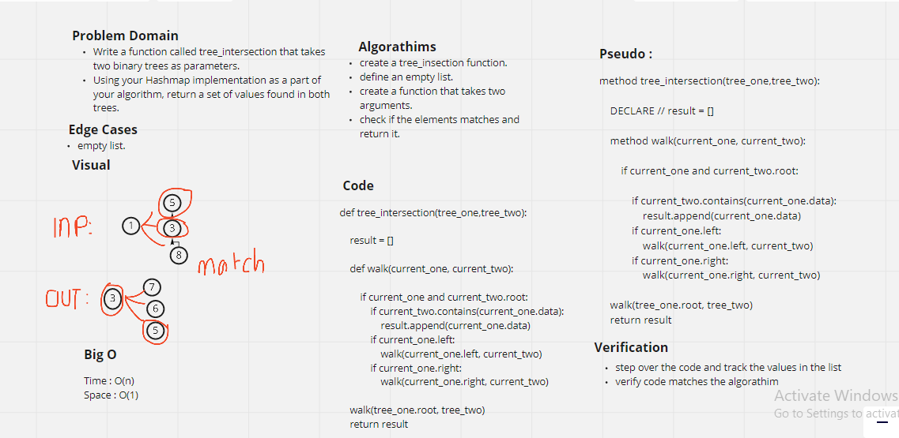

# Tree intersection

* Binary Trees can be in many shapes but are most useful when balanced. Walking Binary Trees in depth-first order is done the same as walking Binary Search Trees which can be done in pre-order, in-order or post-order. Binary Trees, like Binary Search Trees, can also be walked in depth-first order.

## Challenge 

* Utilize the Single-responsibility principle: any methods you write should be clean, reusable, abstract component parts to the whole challenge.

* Write a function called tree_intersection that takes two binary trees as parameters.

## Approach & Efficiency:

Big O :

time -> O(n)
space -> O(1)

# Solution:

