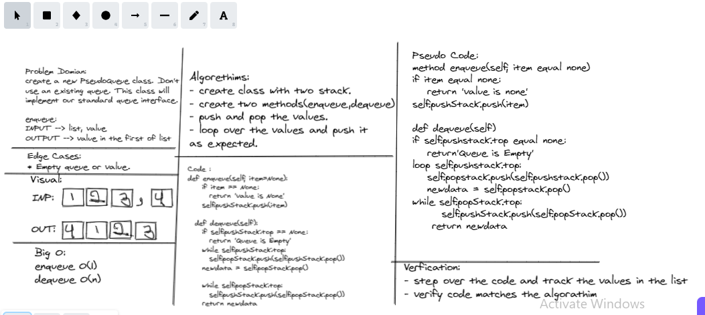

# Stack-queue-animal-shelter

> Define a class called Animalshelter, which takes dogs and cats, It must use FIFO.

enqueue(value) which inserts value into the PseudoQueue, using a first-in, first-out approach. dequeue() which extracts a value from the PseudoQueue, using a first-in, first-out approach. The Stack instances have only push, pop, and peek methods. You should use your own Stack implementation. Instantiate these Stack objects in your PseudoQueue constructor.

## Challenge

* enqueue(animal): Adds animal to the queue. Animal can be either a dog or a cat object.

* dequeue(pref): Returns either a dog or a cat. If pref is not "dog" or "cat" then return null.

## Whiteboard Process

## Approach & Efficiency

* enqueue(animal) -> time O(1) | space O(1)

* dequeue(pref) -> time O(n) space O(1)