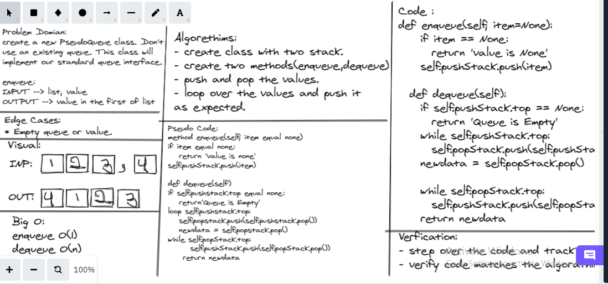

# Stacks and Queues

* A stack is data structure, you can push or pop from it. Push => add after the last element, Pop => deletes the last element, and it has more than these functionality. Stack is like LIFO

* A queue is a data structure, you can enqueue or dequeue from it. enqueue => add in the first element, dequeue => deletes the first element. Queue is like FIFO
## Whiteboard Process

## Challenge

Create a new class called pseudo queue.
Do not use an existing Queue.
Instead, this PseudoQueue class will implement our standard queue interface (the two methods listed below),

## Approach & Efficiency

Big O:

Push ->  O(1)

Pop -> (1)

Enqueue -> O(1)

Dequeue -> (1)

## API

* push onto a stack.

* pop off the stack.

* empty a stack after multiple pops.

* peek the next item on the stack.

* Calling pop or peek on empty stack raises exception.

* enqueue into a queue.

* dequeue out of a queue the expected value.

* peek into a queue, seeing the expected value.

* empty a queue after multiple dequeues.

* Calling dequeue or peek on empty queue raises exception.

* Inserts value into the PseudoQueue, using a first-in, first-out approach.

* Extracts a value from the PseudoQueue, using a first-in, first-out approach.h

